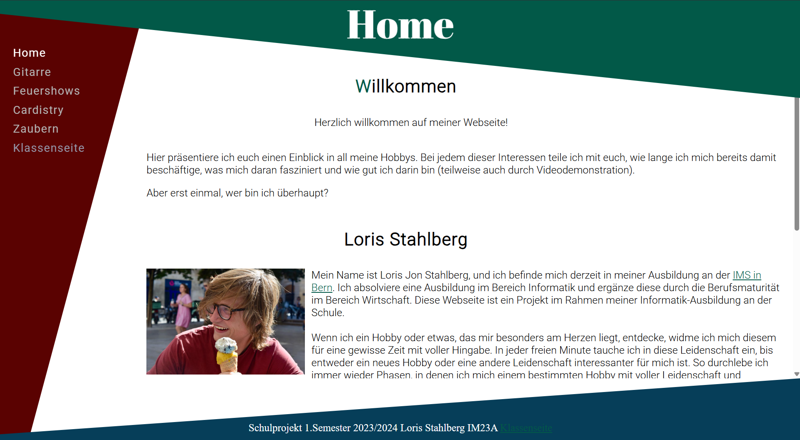
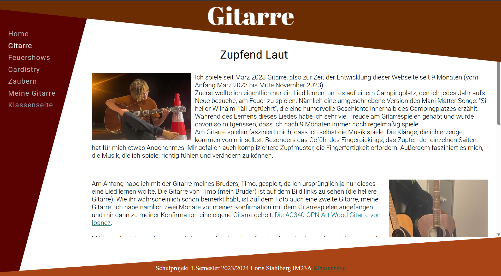
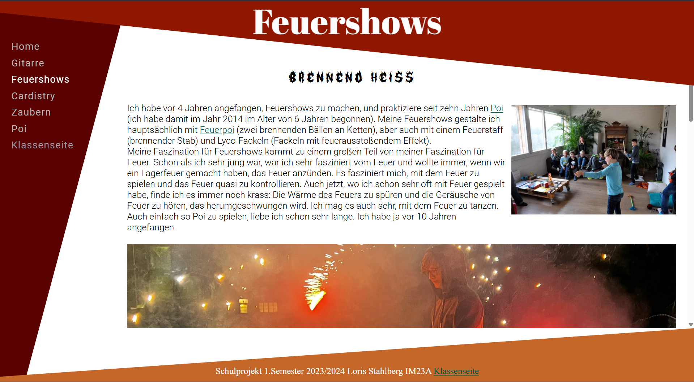
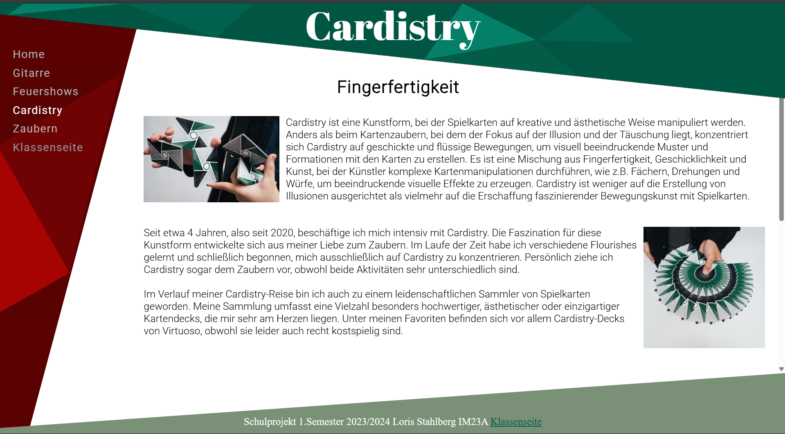
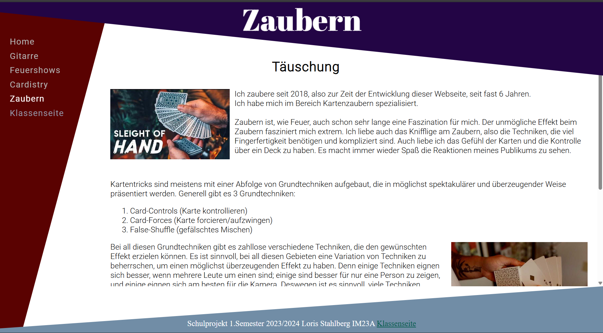
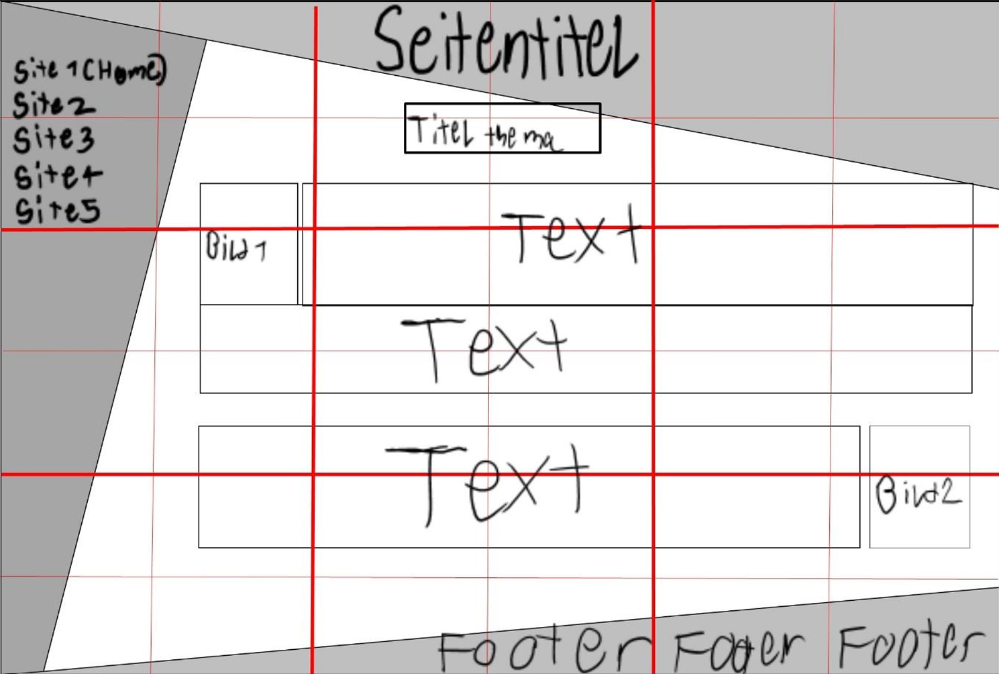

# Meine Hobbys – First Website Project

A fully hand-coded website built with **HTML & CSS** as my very first programming project.  
This project was created as my first step into application development, where I planned, designed, and implemented a complete website entirely without using code generators or AI assistance.

---

## Demo


This short demo walks through the homepage and all four hobby pages: **Gitarre**, **Feuershows**, **Cardistry**, and **Zaubern**.

---

## Key Features

- **Custom Design & Layout** – unique angled header, sidebar, and footer on every page  
- **Consistent Sidebar Navigation** – same sidebar across all pages with active page highlighting  
- **Individual Color Schemes** – each page has a distinct header and footer color theme  
- **Structured Content** – every hobby page describes:
  - How long I have been doing the hobby
  - What fascinates me about it
  - How good I am at it
- **Embedded YouTube Video** – on the Feuershows page  
- **Hidden Easter Egg Page** – accessible only by finding the secret clickable area below the last navigation link

---

## Screenshots

### Homepage


### Gitarre


### Feuershows


### Cardistry


### Zaubern


---

## Design & Planning

Before writing any code, I created a detailed **concept document** including a full layout plan, navigation structure, and color scheme selection.  
Here is the original mock-up that guided the development:



This structured approach allowed me to focus on both **functionality** and **visual design** and was part of the project grading process.

---

## Project Context

This project was my very first experience with developing an application.  
I learned the basics of **HTML** and **CSS**, practiced planning and implementing a complete website, and built something that matched my initial concept.  

> “The goal was to create a fully functioning, well-designed website from scratch, without relying on code-generating tools.”

I successfully finished ahead of schedule and earned the top grade of **6.0**, the highest possible grade.

---

## How to Run the Project

```bash
# Clone this repository
git clone https://github.com/<your-username>/hobbies-website.git

# Open the main page in your browser
open index.html
